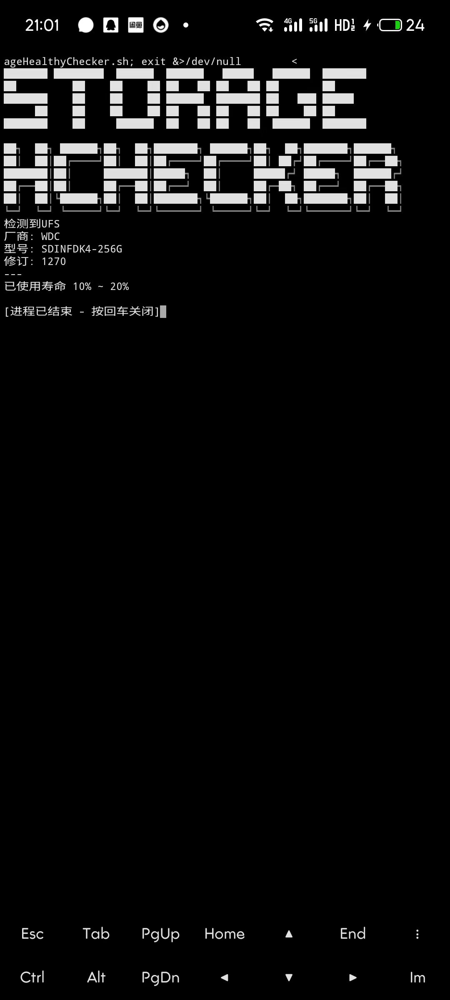
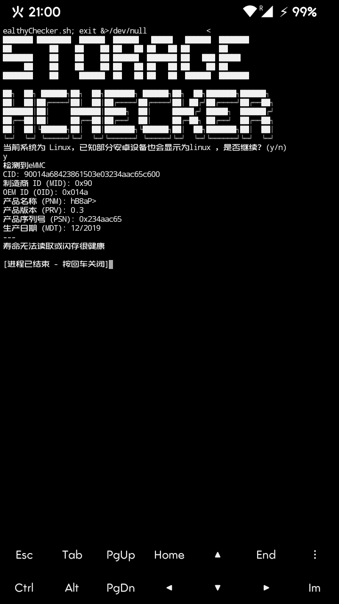

# StorageHealthyChecker
用于检查 Flash 状态的脚本  
包括但不限于 Flash 寿命百分比、供应商和型号  
旨在快速准确地检测隐藏在系统节点中的 Flash 信息  
基于 @Anran2786 的脚本编写  
A script for checking Flash status   
Includes but is not limited to Flash life percentage, vendor and model  
Aims to quickly and accurately detect Flash info hidden in system nodes  
Based on sciprts by @Anran2786  
Todo:
- [x] 基本的读取eMMC已用寿命信息和保留区块使用信息（By @Anran2786）
- [x] 尝试读取Flash的附加信息，如**生产日期，品牌型号等**
- [x] 尝试增加对UFS的支持
- [ ] 将eMMC MID转换为准确的制造商信息，解析MDT算法等CID解析部分
- [ ] More..

